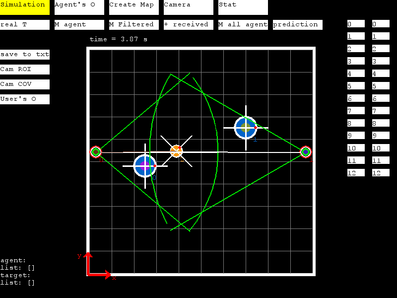
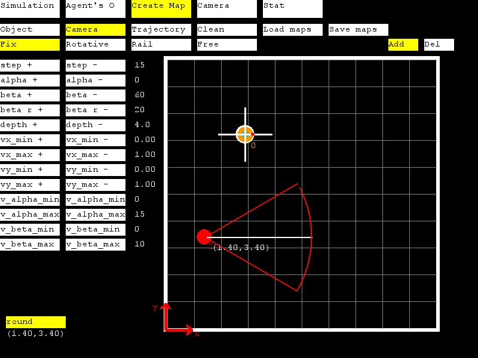
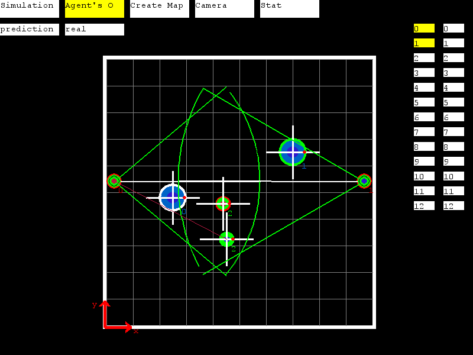
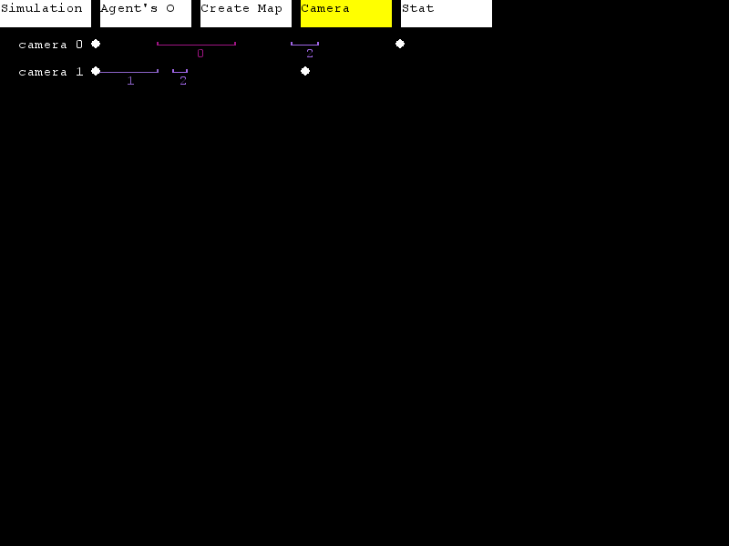
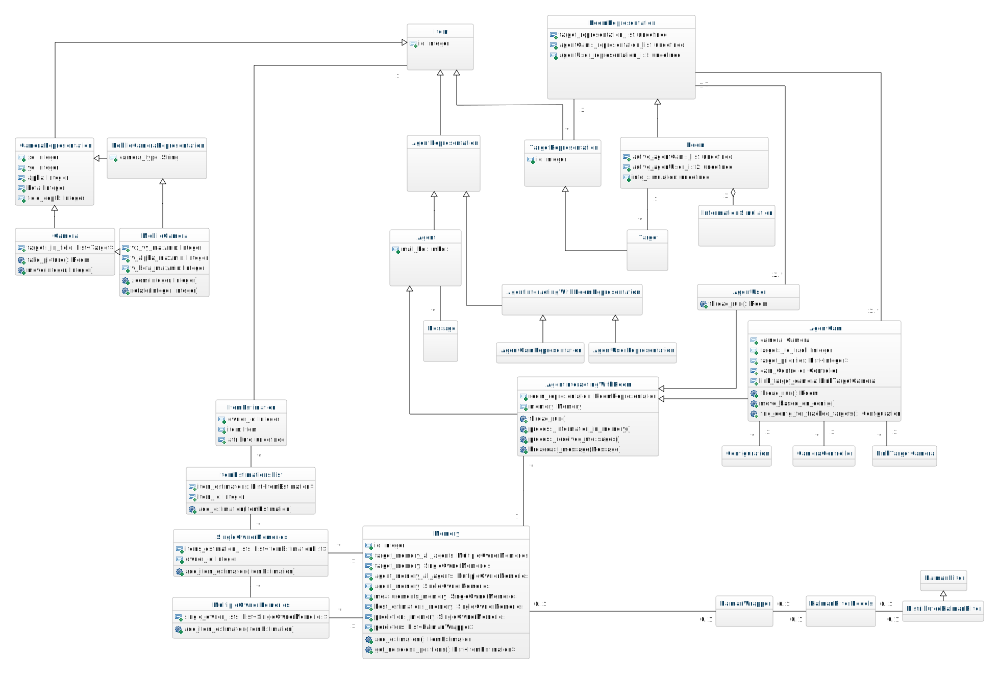

<h1> Master thesis : Multi-agent system</h1>

As part of the reseach to conceptualize a **multi-agent system** aimed for the recognition and tracking of several
targets in a room, this simulator was developped to validate several ideas.

The system develloped is composed of two types of agent : the agent-camera and the agent-user.
    
   - The **"agent-cameras"** collect and filter the data.
    
   - The **"agent-users"** receive estimates from several agent-cameras and combine them 
      to reconstruct the target's trajectories 

<h2> Quick start guide </h2>

Four scenarios, corresponding to the case study presented in the thesis, are available to be tested.

1. Run the file *main.py* is run and the GUI interface shoud appear on the *"simulation tab"*. 

2. Explore the several study case already available.
    
    Usefull keys: 
    - r - reload the current case study from the start
    - n - switch to the next case study
    - p - come back to previous case study
    
    Simulated informations to display are chosen with the buttons (see section GUI interface description) or with  the key-borads
    - s - take a screen-shot of the GUI interface - available after the simulation 
    - f - hide/show camera's field of view
    - g - hide/show a grid (1 square = 1m x 1m)
    - o - haide/show the objective the agent-camera should reach
    - v - hide/show the virtual camrea
    
3. Create your own map using the *"create map tab"*

       1. Once it is saved (see *"creation tab"* description),   it will appear in the folder map under the name of *create_map.txt*.
       2. Rename it.
       3. Add it to the list of names to be run (*map_to_test_name*)  in the file *main.py*.
       4. Set the options in the following list :
            - kalman_distributed = True/False, to use the distributed kalman filter
            - kalman_type = 4, model use
            - t_stop = t, time the simulation should run in s
            - t_scale.= 1, to slow down the simulation but not used.

<h2> GUI interface description </h2>

This interface is totaly optional to obtain the results, however it helps to visualize  dynamically a situation. 
It can be turn on/off by changing the option USE_GUI in the file *constants.py* 

<h3> Simulation tab</h3>

This tab provides a graphical visualisation of the simulated situation.  

The buttons and their usage: 
   
   - on the top: 
       - **real T** - to display the generated target trajectories. 
       - **M agent** - to display the measurement taken by an *"agent-camera"*
       - **M filtered** - to display the estimates filter by an *"agent-camera"*
       - **M received** - not used
       - **M all-agent** - to display all information gathered by the agent on a particular target
       - **predictions** - to display the predictions of the kalman filter 
    
        select multiple "agent-cameras" and the target with the button on the right (column of numbers)
            
   - on the left:
       - **save to txt** - to save the current map in a file called *current_map.txt*.
       - **cam ROI** - to display the region associated to each camera (distance-based criterion).
       - **cam COV** - to display the level of coverage by the camera in each part of the room.
       - **User's O** - to display the estimation received by the *agent-user*, also the output of the overall system.
  
   - on the right:  
       - **column of numbers on the left** - to display informations related to the corresponding *"agent-camera n"* (n being a number).
       - **column of numbers on the right** -   to display informations related to the corresponding target-n (n being a number).
  
<h3> Agent's O tab</h3>    

This tab is use to display the *"room-representation"* (belief each *"agent-camera"* has from the *"real-room"*). 

 - **prediction**  - not used
 - **real** - to compare the *"room-representation"* with the ¨*real-room"*   
 - **column of numbers on the left** - to display informations related to the corresponding *"agent-camera n"* (n being a number).
 - **column of numbers on the right** -  not used.
 

<h3> Create map tab</h3>   

   - **Object** - use **add**/**del**  to add/delete an object on the map, once selected simply click on somewhere in the room. 
   - **Camera** - use **add**/**del**  to add/delete a camera on the map, once selected simply click on somewhere in the room.. 
   - **Trajectory** - to create the trajectory for "moving object" or for "rail cameras"
      1. Add the object or the camera on the map first.   
      2. Select **add_point** and click on the object, then click elsewhere in the room to add via points. 
      3. Save the trajectory
      4. Check the trajectory by selecting **show_traj** and placing the mouse on the object or the camera
   - **Clear** - to clear map from all the elements
   - **Load maps** - to load the map called *create_map.txt* in the folder maps
   - **Save maps** - to save the map under the name of *create_map.txt* in the folder maps

   When the button object or camera is selected, dedicated option appear on the top and on the left. 
        
<h3> Camera tab</h3>  

This tab shows the view seen by each camera in the room. As in reality, the depth is lost. 

<h3> Stat tab</h3>  

This tab is finally not used   

<h2> Folders </h2>

   - **src**,  contains the source code
   - **maps**, contains several maps used as input for the system - new maps can be created with the *create map tab* in the GUI interface.
   - **results**, contains results of a simulation - a new file named after the map is created after each simulation and data can be saved/plotted by enabling the option in the *constants.py* file.\
   (SAVE_DATA=TRUE and PLOT_DATA = TRUE)
   - **to_share**, contains genral results that shows the overall possiblities given by simulations. Results are classified  as they are used in the 
   chapter of the thesis. 
    
<h2> Class diagram </h2>    

<h2> Dependancies </h2>
To be able use the simulator fully, the following libraries are necessary:  
    
 1. **numpy** - available at https://numpy.org/
 2. **filterpy** - kalman filtering algorithm, available at https://filterpy.readthedocs.io/en/latest/
 3. **pygame** - to use the GUI interface, available at: https://www.pygame.org/news  
    (required if USE_GUI == TRUE in the constants.py file)  
 4. **sklearn** - to use the pca-method, available at: https://scikit-learn.org/stable/  
    (required if AGENT_MOVE == TRUE, in the constants.py file)  
 5. **matplolib** - https://matplotlib.org/  
    (required if PLOT == TRUE or to use some plot_function, in the constants.py file)  
     
 The librairies can be all downloaded using pip.  
<h2> License </h2>

<h2> Authors </h2>

**Winant** Antoine  
**Xenakis** Alexandros
